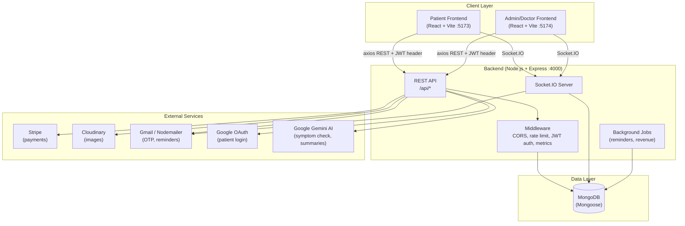
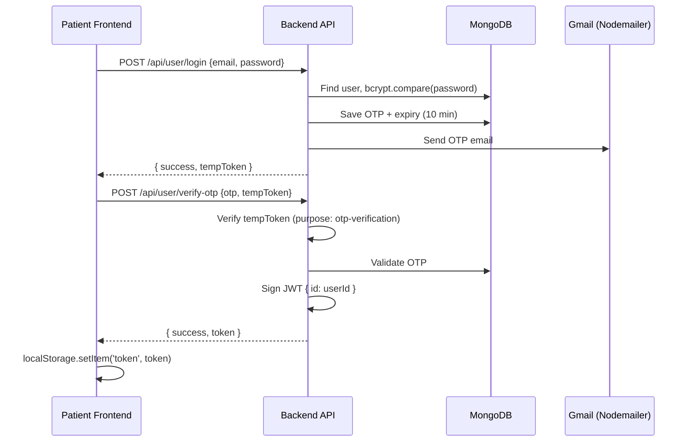
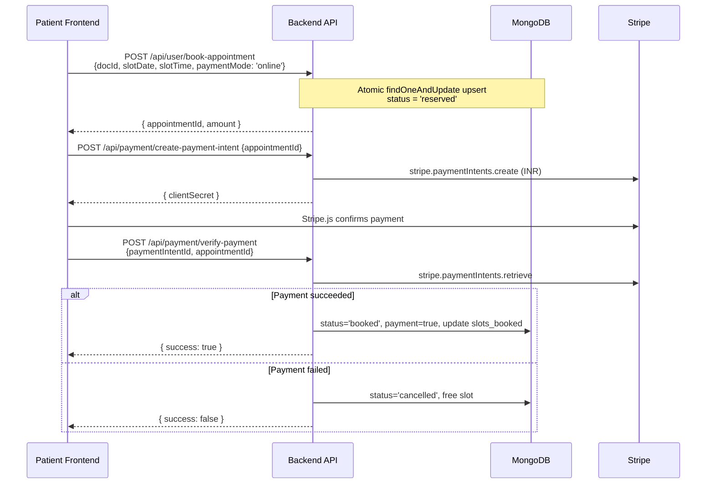
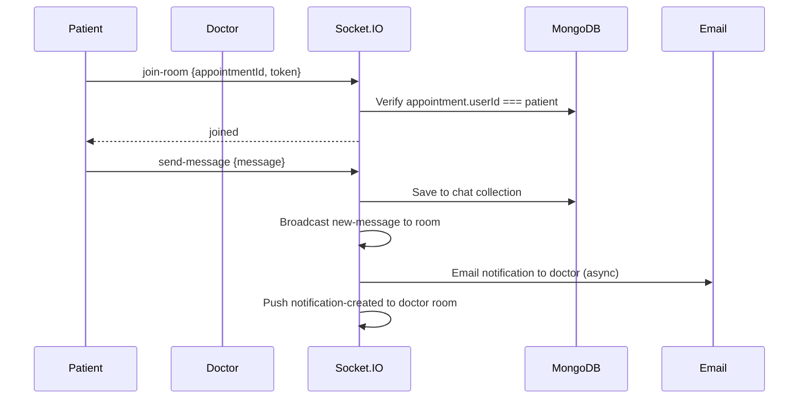
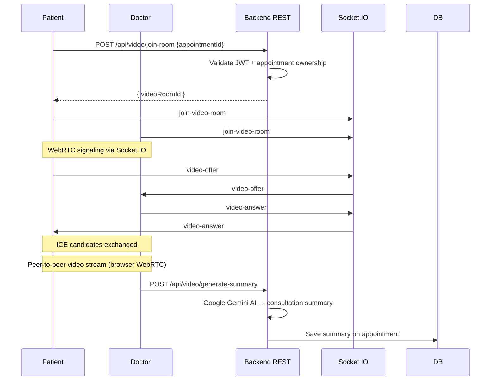
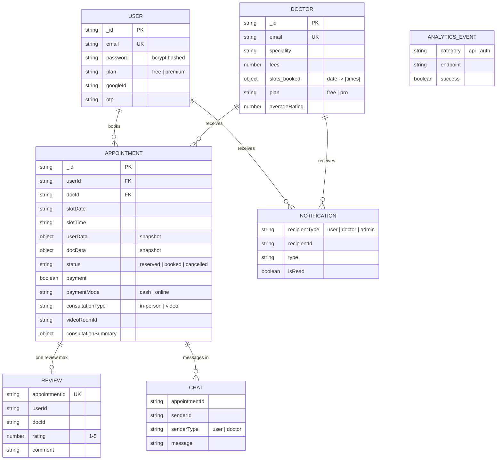
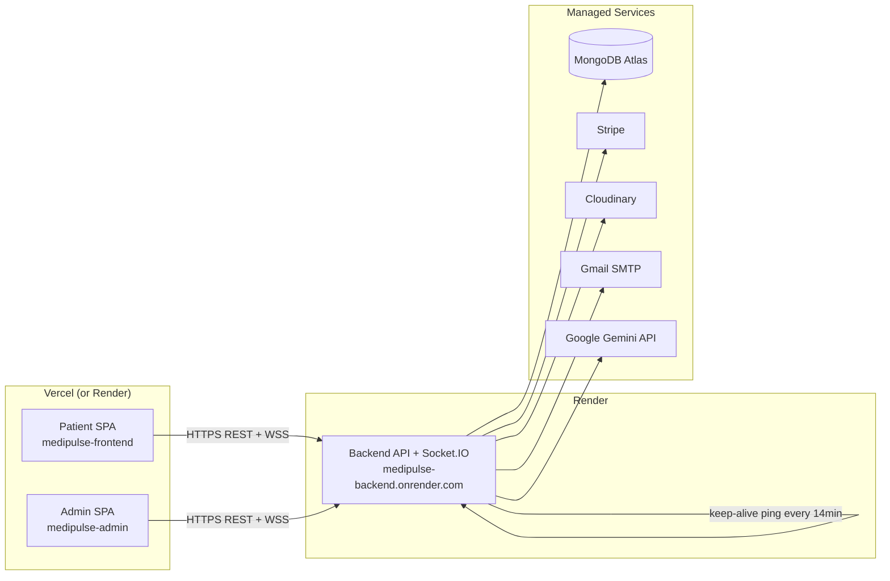

# Medipulse: AI-Powered Full-Stack Doctor Appointment Booking & Online Video Consultancy Platform

Medipulse is a production-style healthcare appointment system with three apps:

1. Patient Web App (React + Vite)
2. Admin and Doctor Dashboard (React + Vite)
3. Backend API and Realtime Server (Node.js + Express + Socket.IO)

It supports appointment booking, online payments, OTP login, Google auth, realtime chat, realtime notifications, WebRTC video consultations, AI-based symptom triage, AI consultation summaries, subscriptions, and revenue analytics.

## Live Deployments

- Patient App: https://medipulse-frontend.onrender.com/
- Admin/Doctor App: https://medipulse-admin.onrender.com/
- Backend API: https://medipulse-backend.onrender.com/

## Architecture Diagrams

### High-Level Architecture

Three-tier system: two React frontends, one Node.js backend, MongoDB, and external services.

```
┌─────────────────────────────────────────────────────────────────────────┐
│                           CLIENT LAYER                                   │
│  ┌──────────────────────┐          ┌──────────────────────────────┐     │
│  │  Patient SPA (React) │          │  Admin/Doctor SPA (React)    │     │
│  │  Browse, book, pay,  │          │  Manage doctors, appointments│     │
│  │  chat, video call    │          │  chat, video, revenue stats  │     │
│  └──────────┬───────────┘          └──────────────┬───────────────┘     │
└─────────────┼──────────────────────────────────────┼─────────────────────┘
              │  REST (axios) + Socket.IO            │
              ▼                                      ▼
┌─────────────────────────────────────────────────────────────────────────┐
│                         BACKEND LAYER (Node.js)                          │
│  ┌─────────────────────────────────────────────────────────────────┐    │
│  │  Express REST API  (/api/user, /api/doctor, /api/admin, ...)    │    │
│  │  + Socket.IO server (chat, notifications, WebRTC signaling)     │    │
│  │  + Background jobs (reminders, revenue alerts)                  │    │
│  └─────────────────────────────────────────────────────────────────┘    │
└─────────────┬───────────────────────────────────────────────────────────┘
              │
              ▼
┌─────────────────────────────────────────────────────────────────────────┐
│                    DATA & EXTERNAL SERVICES                              │
│  MongoDB (Mongoose)  │  Stripe  │  Cloudinary  │  Gmail (Nodemailer)   │
│                      │  Google OAuth  │  Google Gemini AI               │
└─────────────────────────────────────────────────────────────────────────┘
```

### System Architecture



### Patient Login Flow (Email + OTP)



### Book Appointment Flow (Online Payment)



Cash booking skips Stripe — `book-appointment` immediately sets `status: 'booked'`.

### Real-Time Chat Flow



### Video Consultation Flow (WebRTC)



### Database Schema



### API Request Lifecycle

```
Patient clicks "Book Appointment"
        │
        ▼
┌──────────────────────────────────────────────────┐
│ 1. FRONTEND (Appointment.jsx)                    │
│    axios.post(backendUrl + '/api/user/book-...') │
│    headers: { token: localStorage.getItem(...) } │
└──────────────────────┬───────────────────────────┘
                       ▼
┌──────────────────────────────────────────────────┐
│ 2. EXPRESS MIDDLEWARE CHAIN                      │
│    CORS → express.json() → globalLimiter         │
│    → apiMetricsTracker → authUser (JWT verify)   │
└──────────────────────┬───────────────────────────┘
                       ▼
┌──────────────────────────────────────────────────┐
│ 3. ROUTE → CONTROLLER                            │
│    userRoute.js → userController.bookAppointment │
│    Business logic + MongoDB operations           │
└──────────────────────┬───────────────────────────┘
                       ▼
┌──────────────────────────────────────────────────┐
│ 4. RESPONSE                                      │
│    res.json({ success: true/false, ...data })    │
│    (metrics middleware logs to analyticsEvent)   │
└──────────────────────┬───────────────────────────┘
                       ▼
┌──────────────────────────────────────────────────┐
│ 5. FRONTEND handles response                     │
│    success → toast + redirect                    │
│    failure → show error message                  │
└──────────────────────────────────────────────────┘
```

### Deployment Architecture



## What Is Implemented

### Patient Features

- Email/password registration and login
- OTP-based login verification (2-step login)
- Google sign-in
- Forgot password and reset password flow (email link)
- Doctor listing with speciality filtering
- Smart natural-language doctor search
- AI symptom checker with urgency guidance and speciality recommendation
- In-person and video consultation booking
- Slot reservation flow to reduce double-booking race conditions
- Cash and online payment modes
- Stripe payment for appointments
- Appointment list, cancellation, and re-payment for unpaid appointments
- Doctor review and rating submission for completed appointments
- Realtime chat with doctor for appointment-specific conversations
- Realtime notifications (chat, reminders, system events)
- WebRTC video consultation
- Premium patient plan purchase and status tracking
- Profile management with image upload

### Doctor Features

- Secure doctor login
- Doctor dashboard with earnings, patient count, and appointment stats
- View and manage appointments
- Cancel and complete appointments
- Availability toggle
- Profile update (fees, address, availability)
- Realtime chat with patient
- Realtime notifications
- WebRTC video consultation
- AI consultation summary generation from notes
- Email delivery of consultation summary to patient
- Doctor subscription plans:
  - Pro plan
  - Featured listing plan

### Admin Features

- Admin authentication
- Dashboard with doctor/user/appointment counts
- Add and delete doctors
- View all doctors and appointments
- Change doctor availability
- Cancel appointments
- Public stats endpoint for landing/about section
- Revenue analytics endpoint (appointments + subscriptions)
- Realtime admin notifications
- Utility endpoint to fix completed appointments with unpaid flags

### Backend/Platform Features

- REST API architecture with role-based middleware (user, doctor, admin)
- MongoDB models for users, doctors, appointments, reviews, chat, notifications
- Cloudinary image upload support
- Stripe payment intents and verification
- Global, auth, and payment rate limiters
- Socket.IO messaging for:
  - Chat rooms
  - Notification rooms
  - Video signaling
- Reminder scheduler (runs every minute):
  - Video appointment reminders around 1 hour before
  - In-person reminders around 4 hours before
  - In-app notifications + reminder emails
- Email service templates for:
  - OTP
  - Password reset
  - Appointment reminders
  - Consultation summaries
- AI fallback strategy for symptom checker and consultation summary generation when model output fails

## Project Structure

```text
Medipulse/
|- Medipulse-Backend/
|  |- backend/
|  |  |- config/
|  |  |- controllers/
|  |  |- middleware/
|  |  |- models/
|  |  |- routes/
|  |  |- services/
|  |  |- server.js
|  |  |- package.json
|
|- Medipulse-Frontend/
|  |- frontend/   (Patient app)
|  |  |- src/
|  |  |- package.json
|  |
|  |- admin/      (Admin + Doctor app)
|     |- src/
|     |- package.json
```

## Tech Stack

### Frontend

- React 18 + Vite
- React Router
- Context API
- Axios
- Tailwind CSS
- React Toastify
- Framer Motion
- Stripe React SDK
- Socket.IO Client

### Backend

- Node.js + Express
- MongoDB + Mongoose
- JWT authentication
- bcrypt password hashing
- Cloudinary uploads
- Stripe payments
- Socket.IO realtime layer
- Nodemailer email delivery
- Google Gemini API (symptom triage + consultation summaries)
- express-rate-limit

## Authentication and Security

- JWT auth for user and doctor accounts
- Admin token validation using environment credentials
- OTP verification step on user login
- Password hashing with bcrypt
- Brute-force-resistant auth limiter
- Payment-specific rate limiter
- Global API throttle
- CORS allowlist with localhost development support

## Booking and Payment Flow

1. Patient selects doctor, date/time, consultation type, and payment mode.
2. Backend reserves slot with an atomic reservation strategy.
3. If payment mode is cash: booking is confirmed directly.
4. If payment mode is online: frontend creates Stripe payment intent.
5. On verification success, appointment is marked paid and booked.
6. Commission values are recorded on appointment confirmation.

## Video Consultation Flow

1. User/doctor requests room join from `/api/video/join-room`.
2. Backend validates appointment ownership and consultation type.
3. WebRTC signaling occurs over Socket.IO (`join-video-room`, `video-offer`, `video-answer`, `ice-candidate`).
4. Doctor can generate AI consultation summary at call end.
5. Summary is saved to appointment and emailed to patient.

## Environment Variables

Create `.env` in `Medipulse-Backend/backend`.

```env
# Core
PORT=4000
NODE_ENV=development
MONGODB_URI=mongodb://localhost:27017
JWT_SECRET=your_jwt_secret

# Admin login
ADMIN_EMAIL=admin@example.com
ADMIN_PASSWORD=your_admin_password

# Cloudinary
CLOUDINARY_NAME=your_cloudinary_name
CLOUDINARY_API_KEY=your_cloudinary_api_key
CLOUDINARY_SECRET_KEY=your_cloudinary_secret

# Email (Gmail app password recommended)
EMAIL_USER=your_email@gmail.com
EMAIL_PASS=your_email_app_password

# Frontend base URL (for reset links and email CTA)
FRONTEND_URL=http://localhost:5173

# Stripe
STRIPE_SECRET_KEY=your_stripe_secret_key

# Google OAuth
GOOGLE_CLIENT_ID=your_google_client_id

# Google Gemini
GEMINI_API_KEY=your_gemini_api_key

# Optional tuning
VIDEO_DISCOUNT_PERCENT=20
VIDEO_COMMISSION_RATE=20
GLOBAL_RATE_LIMIT_MAX=2000
```

Create `.env` in `Medipulse-Frontend/frontend`.

```env
VITE_BACKEND_URL=http://localhost:4000
```

Create `.env` in `Medipulse-Frontend/admin`.

```env
VITE_BACKEND_URL=http://localhost:4000
```

## Local Setup

### 1. Clone

```bash
git clone https://github.com/rathoreanuj/Medipulse.git
cd Medipulse
```

### 2. Install dependencies

```bash
cd Medipulse-Backend/backend
npm install

cd ../../Medipulse-Frontend/frontend
npm install

cd ../admin
npm install
```

### 3. Run in development

Backend:

```bash
cd Medipulse-Backend/backend
npm run server
```

Patient app:

```bash
cd Medipulse-Frontend/frontend
npm run dev
```

Admin/Doctor app:

```bash
cd Medipulse-Frontend/admin
npm run dev
```

## API Overview

Base URL: `/api`

### User

- `POST /user/register`
- `POST /user/login`
- `POST /user/verify-otp`
- `POST /user/forgot-password`
- `POST /user/reset-password`
- `POST /user/google-auth`
- `GET /user/get-profile`
- `POST /user/update-profile`
- `POST /user/book-appointment`
- `GET /user/appointments`
- `POST /user/cancel-appointment`
- `POST /user/review`
- `GET /user/reviewed-appointments`
- `GET /user/doctor-reviews/:docId`
- `POST /user/symptom-check`
- `POST /user/smart-search`

### Doctor

- `POST /doctor/login`
- `GET /doctor/list`
- `GET /doctor/appointments`
- `POST /doctor/cancel-appointment`
- `POST /doctor/change-availability`
- `POST /doctor/complete-appointment`
- `GET /doctor/dashboard`
- `GET /doctor/profile`
- `POST /doctor/update-profile`

### Admin

- `POST /admin/login`
- `POST /admin/add-doctor`
- `GET /admin/all-doctors`
- `POST /admin/delete-doctor`
- `POST /admin/change-availability`
- `GET /admin/appointments`
- `POST /admin/cancel-appointment`
- `GET /admin/dashboard`
- `POST /admin/fix-completed-appointments`
- `GET /admin/public-stats`

### Payments and Plans

- `POST /payment/create-payment-intent`
- `POST /payment/verify-payment`
- `POST /payment/pay-appointment`
- `POST /subscription/doctor/plan-status`
- `POST /subscription/doctor/create-payment`
- `POST /subscription/patient/plan-status`
- `POST /subscription/patient/create-payment`
- `POST /subscription/verify-payment`
- `GET /subscription/admin/revenue-stats`

### Chat, Notification, Video, Contact

- `GET /chat/messages/:appointmentId`
- `GET /chat/doctor/messages/:appointmentId`
- `GET /notification/user`
- `POST /notification/user/mark-read`
- `POST /notification/user/mark-all-read`
- `GET /notification/doctor`
- `POST /notification/doctor/mark-read`
- `POST /notification/doctor/mark-all-read`
- `GET /notification/admin`
- `POST /notification/admin/mark-read`
- `POST /notification/admin/mark-all-read`
- `POST /video/join-room`
- `POST /video/generate-summary`
- `POST /contact/send`

## Socket.IO Events

### Client -> Server

- `join-notification-room`
- `join-room`
- `send-message`
- `join-video-room`
- `video-offer`
- `video-answer`
- `ice-candidate`
- `end-call`

### Server -> Client

- `joined-notification-room`
- `chat-notification`
- `notification-created`
- `joined`
- `new-message`
- `video-joined`
- `video-peer-joined`
- `video-offer`
- `video-answer`
- `ice-candidate`
- `call-ended`
- `peer-disconnected`
- `video-error`

## Deployment Notes

- The backend includes a keep-alive ping for Render free-tier cold-start mitigation.
- CORS and Socket.IO origin checks support deployed apps and localhost development.
- Set all environment variables in your deployment platform before release.

## Maintainer

- Developer: Anuj Rathore
- GitHub: https://github.com/rathoreanuj
- Email: anujrathore385@gmail.com

## License

Both backend and frontend apps include MIT-style license files in their respective folders.
